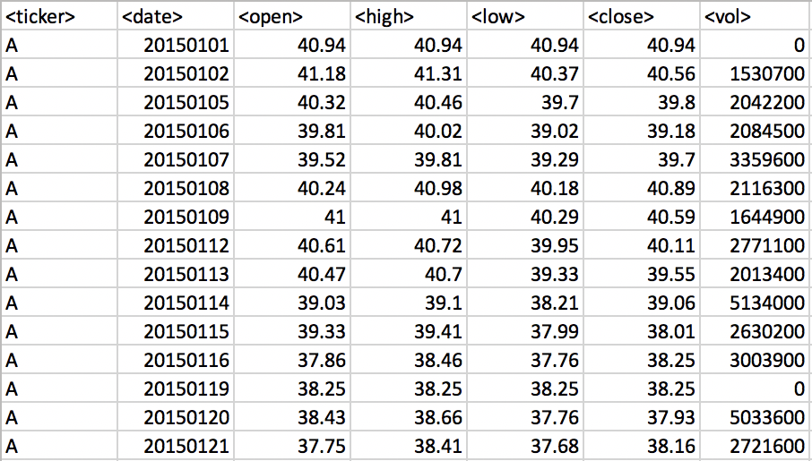

# Stock Price Analysis

## Business Requirements

1. Calculate the total volume each stock had over each year.
2. Calculate the yearly dollar and percent change from the stock open price at the beginning of the year vs the closing price at the end of the year. Then conditionally format the yearly change with green indicating an increase, while red indicates a decrease.
3. Determine the stock with the "Greatest % Increase", "Greatest % Decrease" and "Greatest Total Volume".
    - Allow this macro to be run on every worksheet by running it only once.

<!-- ### Files

* [Stock Data Raw](Raw_Data/stock_data_raw.xlsx) - Run your scripts on this data to generate the final homework report.
* [Stock Data w/VBA](Raw_Data/stock_data_wVBA.xlsm) - Run your scripts on this data to generate the final homework report. -->

## Results

### Part 0 - Raw Stock Data

### Part 1 - Tickers & Total Stock Volumes 

### Part 2 - Yearly Change, Percent Change, Conditional Formatting

### Part 3 - Summary Dashboard - Greatest Increases, Decreases and Volume

## Key Technical Skills Applied

* Excel
* Visual Basic
* Macros
* Conditional Statements (if, elseif, else, then)
* Loops (For loops)
